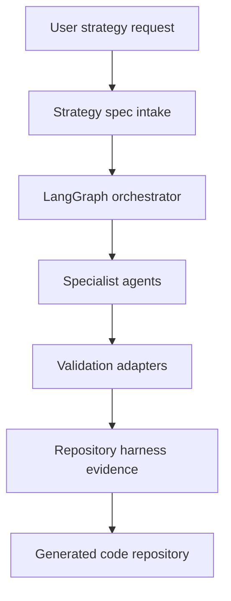
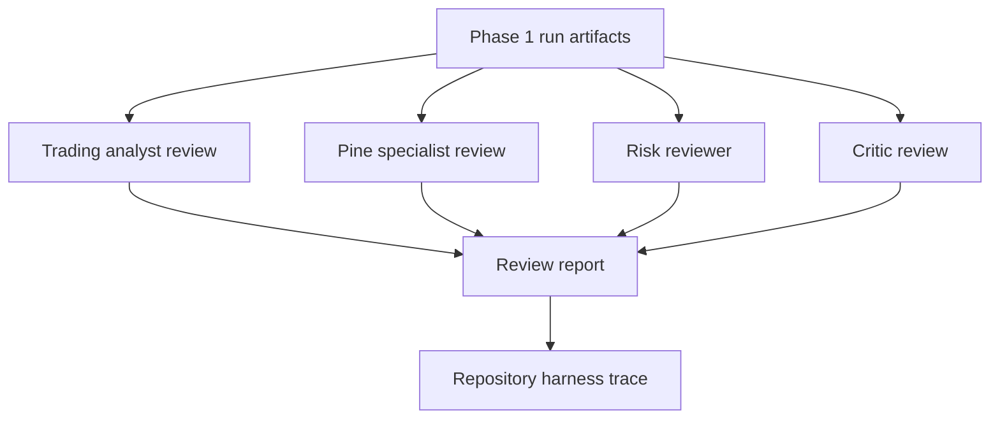
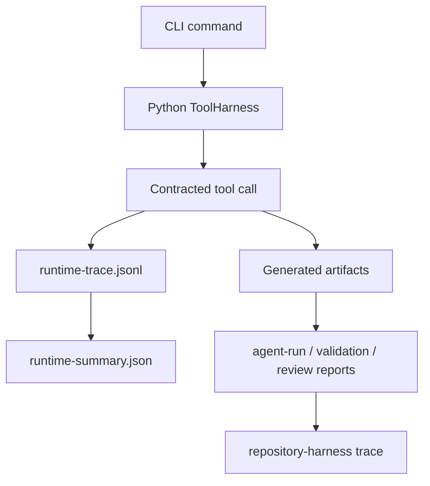
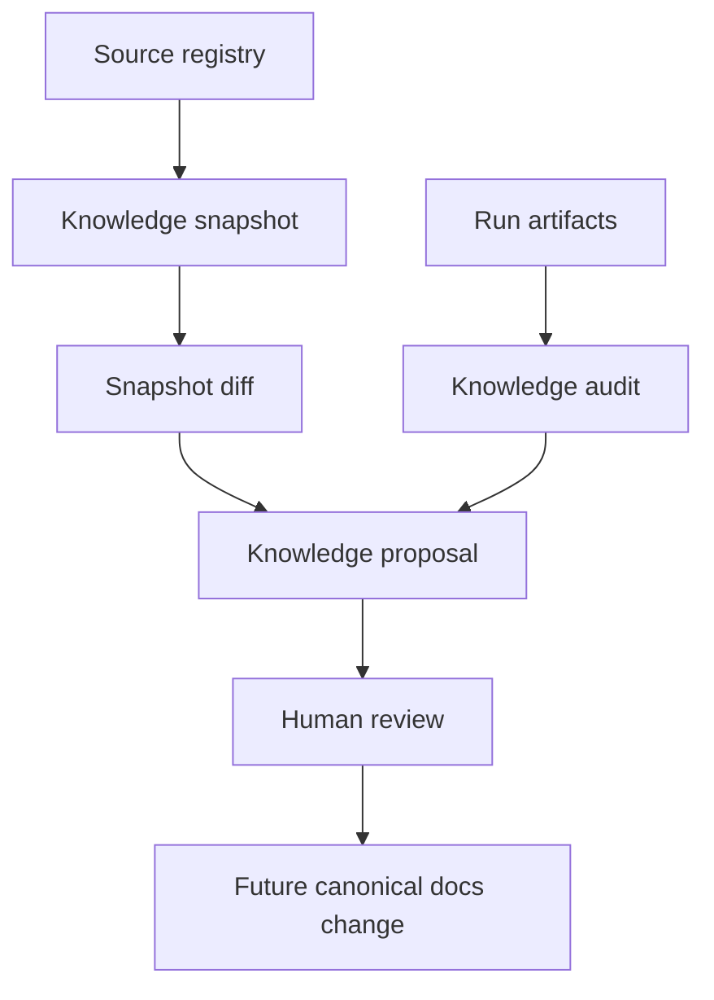
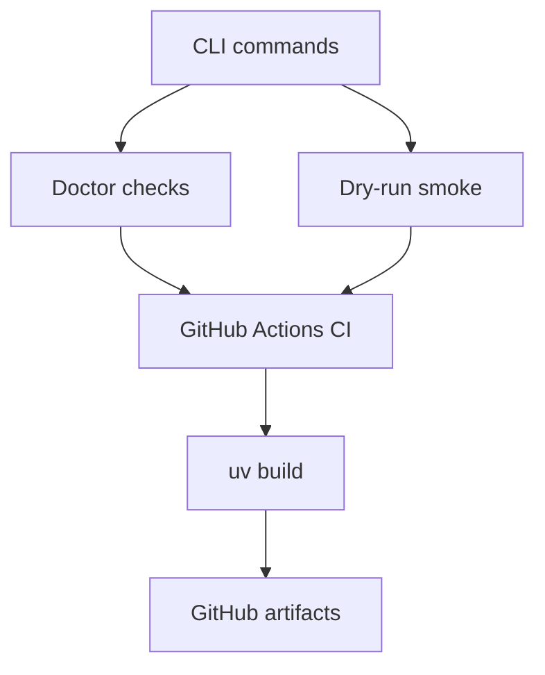
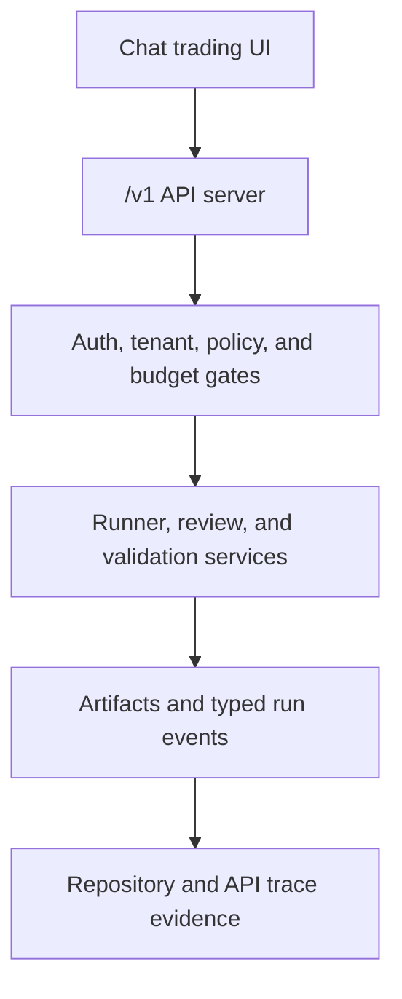

# Architecture

`strategy-codebot` is a harness-first AI agent system for trading strategy code generation and review.

## Default Stack

- Repository harness: `repository-harness` operating model.
- Orchestration: Python LangGraph.
- Model gateway: LiteLLM-compatible provider names.
- Knowledge retrieval: source registry plus future BM25/vector index.
- Validation: platform-specific gates recorded through normalized reports.

## System Layers

## Agent Runtime Boundary

Phase 0 defines agent roles and schemas. Phase 1 implements a minimal single-agent runtime. Phase 2 adds parallel review while preserving these boundaries:

- The orchestrator owns state transitions.
- Specialists own bounded reviews or code-generation tasks.
- The validator owns proof collection and normalized validation reports.
- The harness auditor owns trace and decision evidence.

## Phase 2 Review Flow

Parallel review is fail-soft: one reviewer error produces a partial review report instead of crashing the run. Review reports do not replace static validation or platform proof.

## Phase 3 Tool Runtime Flow

The runtime harness is local and Python-native. It records ordered tool events and policy mode, while `repository-harness` remains the repo-level operating model.

## Phase 4 Knowledge Loop

The knowledge loop is proposal-first. It can detect stale or changed sources and recurring run evidence, but it does not edit canonical docs without a separate human-approved change.

## Phase 5 Productization Flow

Phase 5 hardens the CLI for source installs, repeatable checks, and GitHub artifact builds. It does not add API, web UI, PyPI publishing, or trading execution capability.

## API Initiative Phase 0

The API initiative is a future SaaS product surface, not current Phase 5
runtime behavior. The CLI remains the current production surface until a future
API phase is implemented and verified.

The API server is planned as a domain workflow server, not a generic LLM proxy.
It must preserve the existing safety boundary while adding SaaS-ready
conversation, run, artifact, feedback, and streaming-event interfaces. Public
resources use opaque IDs and are designed around user plus workspace
authorization from day one.

The first streaming transport is Server-Sent Events for chat and run progress.
WebSocket support is deferred until a future UI requires bidirectional realtime
interaction.

## Backtest Preview Worker Boundary

PineForge integration uses a separate Node/TypeScript worker plus a dedicated
`pineforge-runner` service. The Python API
creates queued `backtest-preview` runs and persists `run_jobs`; workers lease
jobs from Postgres, write artifacts under the shared artifact root, and append
typed run events. The API process does not execute PineForge directly.

Backtest preview reports are local preview evidence only. They are not
TradingView proof, MQL5 proof, live-trading evidence, broker execution evidence,
or profitability claims. Allowed worker runtime is limited to PineForge local
preview execution and read-only market data adapters; live, paper, broker,
Telegram, and Docker live surfaces remain blocked.

## Platform Boundary

Pine Script and MQL5 are not interchangeable:

- Pine Script v6 runs in TradingView. Phase 1 validation starts with static checks and manual TradingView proof.
- MQL5 runs in MetaTrader 5. Future automated validation requires Windows plus MetaEditor/MetaTrader tooling.

## Safety Boundary

The system generates and reviews code. It must not place live trades, connect broker accounts, or claim profitability without future explicit decisions and risk controls.
