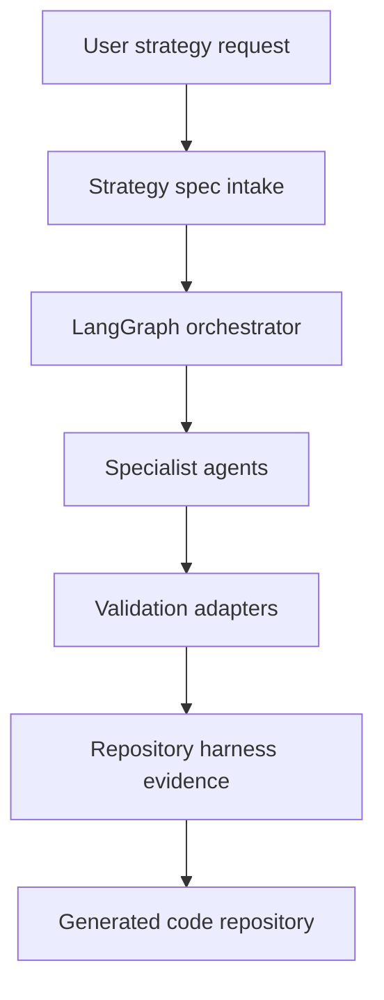
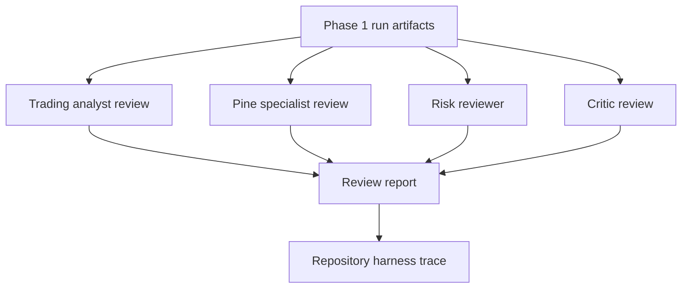
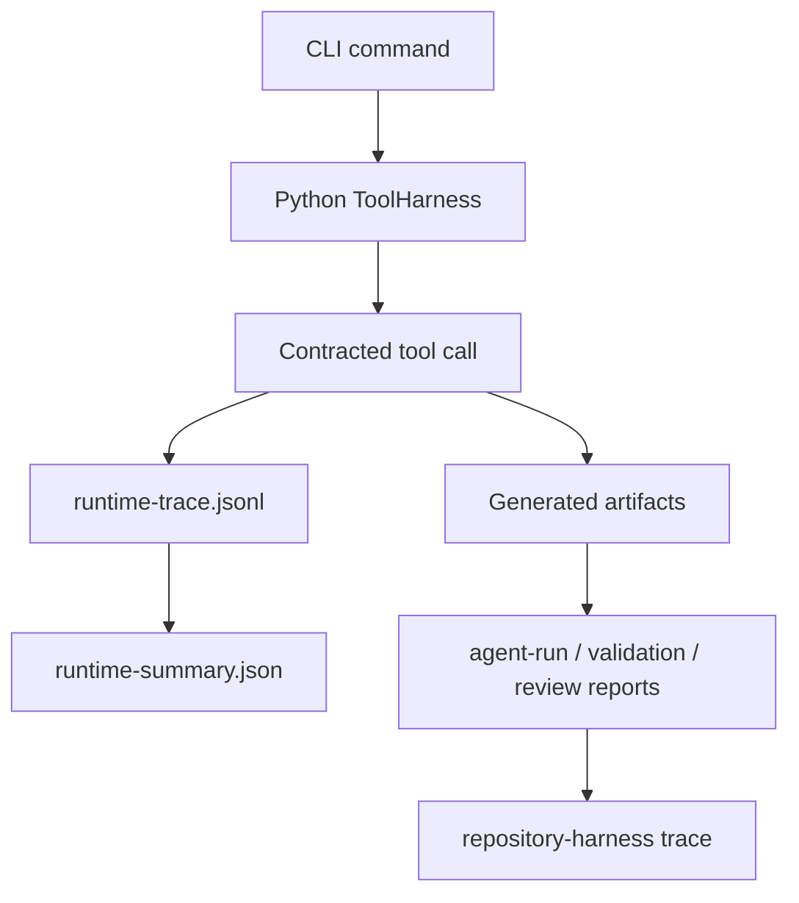

# Architecture

`strategy-codebot` is a harness-first AI agent system for trading strategy code generation and review.

## Default Stack

- Repository harness: `repository-harness` operating model.
- Orchestration: Python LangGraph.
- Model gateway: LiteLLM-compatible provider names.
- Knowledge retrieval: source registry plus future BM25/vector index.
- Validation: platform-specific gates recorded through normalized reports.

## System Layers

## Agent Runtime Boundary

Phase 0 defines agent roles and schemas. Phase 1 implements a minimal single-agent runtime. Phase 2 adds parallel review while preserving these boundaries:

- The orchestrator owns state transitions.
- Specialists own bounded reviews or code-generation tasks.
- The validator owns proof collection and normalized validation reports.
- The harness auditor owns trace and decision evidence.

## Phase 2 Review Flow

Parallel review is fail-soft: one reviewer error produces a partial review report instead of crashing the run. Review reports do not replace static validation or platform proof.

## Phase 3 Tool Runtime Flow

The runtime harness is local and Python-native. It records ordered tool events and policy mode, while `repository-harness` remains the repo-level operating model.

## Platform Boundary

Pine Script and MQL5 are not interchangeable:

- Pine Script v6 runs in TradingView. Phase 1 validation starts with static checks and manual TradingView proof.
- MQL5 runs in MetaTrader 5. Future automated validation requires Windows plus MetaEditor/MetaTrader tooling.

## Safety Boundary

The system generates and reviews code. It must not place live trades, connect broker accounts, or claim profitability without future explicit decisions and risk controls.
